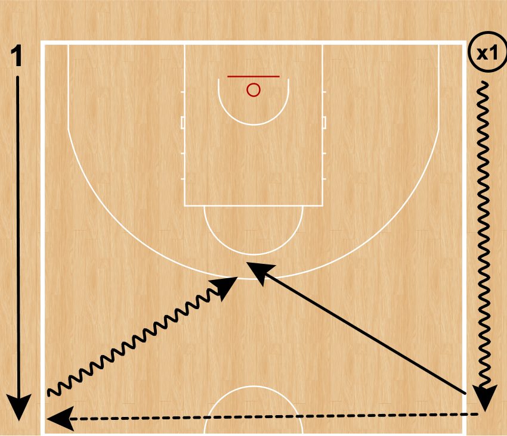

# Abschluss am Korb

## 1on1 mit Vorteil für die Offense (ohne Passer)

Hier sollen die Spielerinnen lernen, einen Vorteil zu behalten und ggf. sogar noch zu verbessern.  
Die Spielerinnen wählen sehr oft die für die Situation passende Form des Abschlusses ohne Vorgabe des Trainers.

### Ball auf dem Rücken

Die Verteidigung steht mit dem Gesicht zum Korb und die Angreiferin steht mit dem Ball direkt hinter hier. Sie legt/drückt den Ball auf den Rücken der Verteidigung.  
Das Spiel beginnt, sobald der Ball den Rücken der Verteidigerin nicht mehr berührt.

### Touch the cone

Auf den Freiwurfecken stehen 2 Hütchen, Stühle oder ähnliches.  
An der 3er-Linie (oder etwas näher) auf der Korb-Korb-Linie steht die Angreiferin.  
In der Mitte der Zone steht die Verteidigerin.  
Die Verteidigerin rennt zu einem Hütchen und berührt dieses. Danach versucht sie die Angreiferin aufzuhalten.  
Sobald die Verteidigerin losläuft, darf die Angreiferin starten. Sie kann wählen, um welches Hütchen sie dribblen will...

### Handover

Verteidigerin steht mit dem Ball innerhalb 3er-Linie an der Position von der gespielt werden soll mit dem Rücken zum Korb. Sie hält den Ball mit einer Hand deutlich vor einer Schulter bzw. Körperseite.  
Die Angreiferin läuft an der 3er-Linie entlang und "entreisst" der Verteidigerin den Ball, um sofort anzugreifen.  
Die Verteidigerin darf starten, sobald der Ball ihre Hand verlässt.

### Cross Pass Transition

Beide Spielerinnen stehen in den gegenüberliegenden Ecken der Grundlinie.  
Eine Spielerin hat den Ball. Sie dribbelt auf der Seitenauslinie zur Mittellinie. Die andere Spielerin läuft ohne Ball zur Mittelinie.  
Sobald beide angekommen sind, passt die Spielerin mit dem Ball zur gegenüber stehenden Spielerin und sprintet zurück in Verteidigung.

Die andere Spielerin greift sofort an, sobald sie den Ball hat.

**Varianten**:

- Dribblemoves bis zur Mittelliine
- Laufschule bis zur Mittellinie

ø

### Head to Head

Offense und Defense stehen nebeneinander mit dem Gesicht zum Korb an der Dreierlinie.  
Offense dribbelt den Ball. Sobald die Offense startet, darf die Defense auch starten.

**Varianten**:

- Position der Verteidigung ändern um Vorteil zu verkleiner/vergrößern
- Über die Postion der Verteidigung kann auch die Variante des Abschlusses gesteuert werden.

### Russian 1on1

Beide Spielerinnen stehen in den gegenüberliegenden Ecken der Grundlinie.  
Eine Spielerin hat den Ball.
Beide Spielerinnen laufen gleichzeitig an der Dreierlinie entlang, um sich auf der Korb-Korblinie zu treffen.  
Die Spiellerin mit dem Ball läuft etwas weiter innen und macht einen Dribble Handover mit

### Katz und Maus

Je nach Altersgruppe steht ein Hütchen entweder an der Dreierlinie oder etwas näher zum Korb zwischen Angreiferin und Verteidigerin.

Die Verteidigerin startet das Spiel in dem Sie auf einer Seite um das Hütchen läuft, um zu verteidigen.
Die Angreiferin dribbelt auf der freien Seite zum Korb (hoffentlich)

#### Varianten

1. Angreiferin dribbelt mit einer Hand während sie wartet
2. Angreiferin macht Handwechsel während sie wartet
3. Der Ball wird zur Angreiferin gepasst und beide müssen bei Ballerhalt starten.

<!-- ## 1on1 mit Vorteil für die Offense (mit Passer) -->
<!-- ## 1on1 Chase -->
